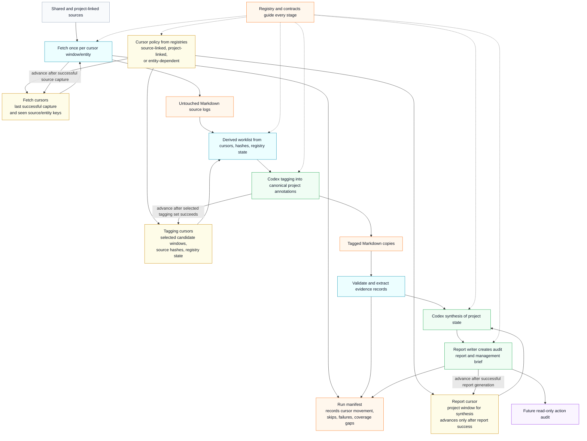
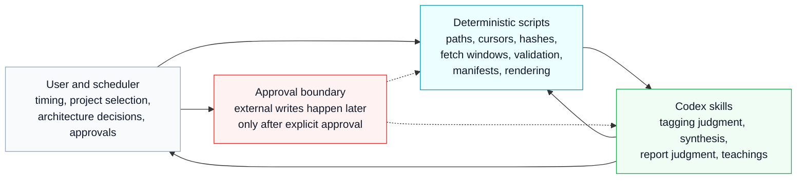

# Simplified Modular Architecture

This is the simpler, module-first view of the State of Project automation. Use
this when discussing system boundaries, future modules, or what should remain
deterministic versus what should be handled by Codex intelligence skills.

For the detailed component and sequence diagrams, see `architecture.md`.

## Modular System Map

```mermaid
flowchart LR
  classDef external fill:#f8fafc,stroke:#94a3b8,color:#0f172a
  classDef governance fill:#eef2ff,stroke:#6366f1,color:#111827
  classDef module fill:#ecfeff,stroke:#0891b2,color:#0f172a
  classDef skill fill:#f0fdf4,stroke:#16a34a,color:#0f172a
  classDef artifact fill:#fff7ed,stroke:#f97316,color:#111827
  classDef future fill:#faf5ff,stroke:#9333ea,color:#111827
  classDef guard fill:#fef2f2,stroke:#dc2626,color:#111827

  Trigger["External scheduler<br/>or human run"]:::external
  SourceSystems["Source systems<br/>Gmail, GitHub, Fireflies,<br/>Drive, deployments"]:::external
  Humans["Management and reviewers"]:::external

  subgraph Governance["Governance"]
    ProjectRegistry["Project registry<br/>canonical tags, aliases,<br/>project-linked resources"]:::governance
    SourceRegistry["Source registry<br/>reader status, source policy,<br/>cursor ownership"]:::governance
    Contracts["Contracts<br/>filesystem, annotations,<br/>runtime, schedule, reporting"]:::governance
    SkillRules["Skill instructions<br/>tagger, synthesizer,<br/>report writer, teacher"]:::governance
  end

  subgraph Capture["Capture"]
    ResourceDiscovery["Resource discovery<br/>planned for repos, deployments,<br/>folders, docs"]:::future
    SourceReaders["Source readers<br/>implemented: Gmail, GitHub<br/>planned: Fireflies batch, Drive, deployments"]:::module
  end

  subgraph SourceLogStore["Source Log Store"]
    UntouchedLogs["Untouched logs<br/>reader-owned source truth"]:::artifact
    TaggedLogs["Tagged logs<br/>tagger-owned annotated copies"]:::artifact
    Cursors["Filesystem cursors<br/>fetch, tagging, report"]:::artifact
    Manifests["Run manifests<br/>coverage, skips, errors"]:::artifact
  end

  subgraph EvidenceLayer["Evidence Layer"]
    Worklist["Derived tagging worklist<br/>not a durable queue"]:::module
    Tagger["Project tagger<br/>Codex annotations,<br/>canonical tags, uncertainty"]:::skill
    Validation["Validation and extraction<br/>deterministic checks,<br/>evidence records"]:::module
  end

  subgraph Intelligence["Project Intelligence"]
    SynthesisPrep["Synthesis prep<br/>evidence pack and scaffold"]:::module
    Synthesizer["Project-state synthesizer<br/>chronology, decisions,<br/>blockers, shipped work"]:::skill
    SynthesisArtifact["Synthesis artifact<br/>canonical JSON/Markdown"]:::artifact
  end

  subgraph OutputLayer["Outputs"]
    ReportWriter["State report writer<br/>audit report plus management brief"]:::skill
    Reports["Reports<br/>JSON/Markdown, HTML/PDF,<br/>preview image"]:::artifact
    ActionAudit["Action and issue auditor<br/>future read-only candidate actions"]:::future
    CandidateActions["Candidate actions<br/>reviewable, not external writes"]:::artifact
  end

  subgraph Feedback["Learning And Guardrails"]
    Teacher["Teacher<br/>captures corrections into<br/>the right durable owner"]:::skill
    Safety["Safety boundary<br/>no external writes without approval<br/>no private runtime artifacts in git"]:::guard
  end

  Trigger --> SourceReaders
  Trigger --> ReportWriter
  SourceReaders --> SourceSystems
  SourceSystems --> SourceReaders

  SourceRegistry --> ResourceDiscovery
  ProjectRegistry --> ResourceDiscovery
  SourceRegistry --> SourceReaders
  ProjectRegistry --> SourceReaders
  Contracts --> SourceReaders
  Contracts --> Worklist
  Contracts --> Validation
  Contracts --> SynthesisPrep
  Contracts --> ReportWriter
  SkillRules --> Tagger
  SkillRules --> Synthesizer
  SkillRules --> ReportWriter
  ResourceDiscovery --> SourceReaders
  SourceReaders --> UntouchedLogs
  SourceReaders --> Manifests
  SourceReaders --> Cursors

  UntouchedLogs --> Worklist
  TaggedLogs --> Worklist
  Cursors --> Worklist
  Worklist --> Tagger
  Tagger --> TaggedLogs
  TaggedLogs --> Validation
  Validation --> SynthesisPrep
  Validation --> Manifests

  SynthesisPrep --> SynthesisArtifact
  SynthesisArtifact --> Synthesizer
  Synthesizer --> SynthesisArtifact
  SynthesisArtifact --> ReportWriter
  ReportWriter --> Reports
  Reports --> Humans

  SynthesisArtifact --> ActionAudit
  Reports --> ActionAudit
  ActionAudit --> CandidateActions
  CandidateActions --> Humans

  Humans --> Teacher
  Teacher --> Contracts
  Teacher --> SkillRules
  Safety -.-> SourceReaders
  Safety -.-> ReportWriter
  Safety -.-> ActionAudit
```

## Linear Data Flow

## New Project Initiation

```mermaid
flowchart TB
  classDef human fill:#f8fafc,stroke:#94a3b8,color:#0f172a
  classDef deterministic fill:#ecfeff,stroke:#0891b2,color:#0f172a
  classDef codex fill:#f0fdf4,stroke:#16a34a,color:#0f172a
  classDef registry fill:#eef2ff,stroke:#6366f1,color:#111827
  classDef artifact fill:#fff7ed,stroke:#f97316,color:#111827
  classDef review fill:#fef2f2,stroke:#dc2626,color:#111827

  Seed["Human seed<br/>project name, repo, people,<br/>keywords, domains, deployments"]:::human
  Dedupe["Check project registry<br/>canonical tags, aliases,<br/>near-duplicate project profiles"]:::deterministic
  RepoAnchor{"Repo anchor exists?"}:::deterministic
  GitHubFirst["GitHub-first discovery<br/>repos, READMEs, commits,<br/>issues, PRs, branches, deployments"]:::deterministic
  NewProjectWindow["No repo anchor<br/>default to previous 7 days<br/>of conversations and docs"]:::deterministic
  FirefliesMetadata["Fireflies metadata first<br/>titles, participants, summaries,<br/>topics, action items, chapters"]:::deterministic
  MultiSourceDiscovery["Discover across available sources<br/>Gmail, GitHub, Fireflies metadata,<br/>Drive, deployments, local state"]:::deterministic
  ProfileDraft["Candidate project profile<br/>description, aliases, strong/weak signals,<br/>resources, confidence, open questions"]:::artifact
  HumanReview{"Human confirms canonical project?"}:::human
  RegistryUpdate["project-tag-registry<br/>canonicalizes profile<br/>and writes governed registry diff"]:::registry
  ReviewOnly["Review only<br/>no canonical project tag<br/>no project-linked fetch/tag cursors"]:::review
  RetagPolicy["Initial retag policy<br/>shared sources: previous 7 days<br/>project-specific resources: project-linked cursors<br/>older backfill: explicit"]:::deterministic
  TaggerObeys["project-tagger obeys registry<br/>creates/updates tagged copies<br/>with canonical annotations"]:::codex
  ReportVisibility["State report visibility<br/>uncertain candidates and coverage gaps<br/>stay visible, not authoritative"]:::artifact

  Seed --> Dedupe
  Dedupe --> RepoAnchor
  RepoAnchor -->|"yes"| GitHubFirst
  RepoAnchor -->|"no"| NewProjectWindow
  NewProjectWindow --> FirefliesMetadata
  GitHubFirst --> MultiSourceDiscovery
  FirefliesMetadata --> MultiSourceDiscovery
  MultiSourceDiscovery --> ProfileDraft
  ProfileDraft --> HumanReview
  HumanReview -->|"confirmed"| RegistryUpdate
  HumanReview -->|"uncertain or rejected"| ReviewOnly
  RegistryUpdate --> RetagPolicy
  RetagPolicy --> TaggerObeys
  ReviewOnly --> ReportVisibility
  TaggerObeys --> ReportVisibility
```

## Responsibility Split

## Reading Guide

- Governance is the source of project identity, source policy, skill behavior,
  and runtime contracts.
- Capture is source-family work. Shared sources are fetched once per source
  window; project-specific sources use project-linked cursors.
- Source logs are the stable proof layer. Readers own untouched logs. The tagger
  owns tagged copies.
- Cursors live in filesystem state and advance only after the stage they govern
  succeeds: fetch after source capture, tagging after the selected tagging set
  succeeds, and report after report generation succeeds.
- The worklist is derived from filesystem state; it is not a durable queue.
- Synthesis is where cross-source project understanding happens.
- Reports are outputs, not sources of truth for future reasoning unless their
  backing synthesis/report JSON is used.
- New project initiation proposes profiles; the registry canonicalizes them; the
  tagger obeys the registry. No new canonical project tag is silently created.
- Action auditing is the next module, but it should remain read-only until the
  external write approval model is explicitly designed.
