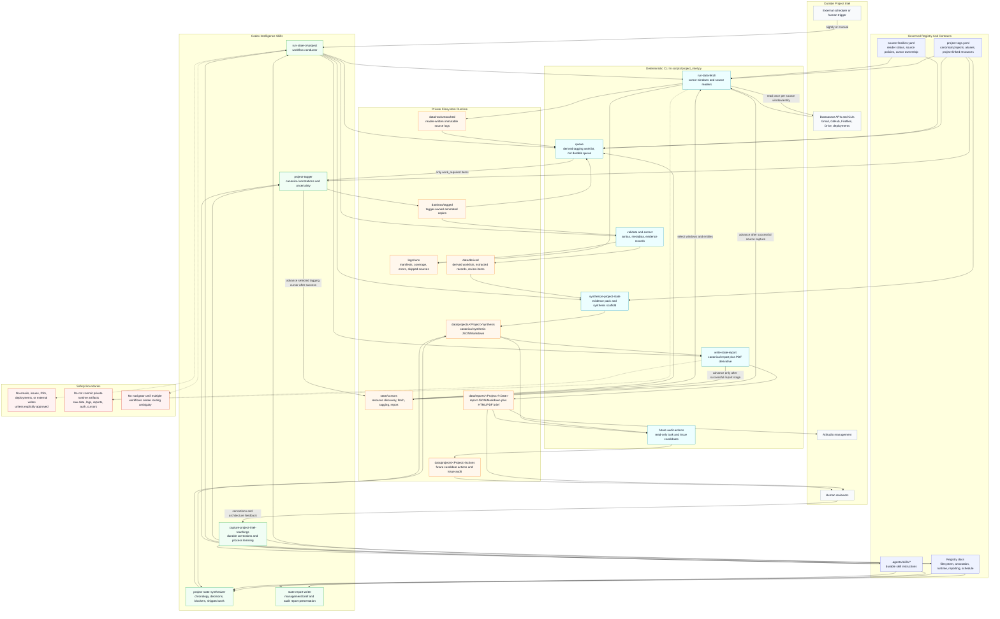

# State Of Project Architecture

This diagram captures the current filesystem-first Project Intel architecture
for the State of Project automation. It distinguishes external scheduling,
deterministic filesystem/CLI plumbing, Codex intelligence skills, registry
contracts, private runtime artifacts, and future read-only action auditing.

## Component Architecture



## Nightly Run Sequence

```mermaid
sequenceDiagram
  autonumber
  participant Scheduler as External scheduler or human
  participant Runner as run-state-of-project
  participant Registry as Registry contracts
  participant CLI as scripts/project_intel.py
  participant Sources as Datasources
  participant FS as Private filesystem
  participant Tagger as project-tagger
  participant Synth as project-state-synthesizer
  participant Writer as state-report-writer
  participant Mgmt as AiStudio management

  Scheduler->>Runner: Trigger data fetch and project report
  Runner->>Registry: Load project profiles, source policies, cursor rules
  Runner->>CLI: run-data-fetch
  CLI->>FS: Read fetch cursors
  CLI->>Sources: Fetch implemented source windows/entities once
  Sources-->>CLI: Source records
  CLI->>FS: Write untouched logs and run manifest
  CLI->>FS: Advance fetch cursors after successful capture

  Runner->>CLI: Build derived tagging worklist
  CLI->>FS: Compare untouched logs, tagged logs, hashes, registry state, metadata
  alt Tagging work is required
    Runner->>Tagger: Annotate only work_required source artifacts/entities
    Tagger->>FS: Create or update tagged copies with canonical annotations
    Runner->>CLI: Validate tagged logs and advance selected tagging cursors
  else Tagged logs are current
    Runner->>CLI: Skip current items
  end

  Runner->>CLI: synthesize-project-state &lt;Project&gt;
  CLI->>FS: Extract confirmed and uncertain evidence for the report window
  CLI->>FS: Write synthesis scaffold and evidence pack
  Runner->>Synth: Fill reasoning from confirmed evidence
  Synth->>FS: Write completed synthesis with self-evaluation

  Runner->>Writer: write-state-report &lt;Project&gt;
  Writer->>FS: Write report JSON and Markdown with evidence links
  Writer->>FS: Render HTML/PDF management brief and preview
  Writer->>FS: Advance report cursor after successful report stage
  Writer-->>Mgmt: Human-readable state-of-project brief
```

## Architecture Notes

- Fetching and tagging are source-artifact or source-entity stages, not
  per-report stages.
- Shared datasources use source-linked cursors; project-specific resources use
  project-linked cursors; new canonical projects get a default seven-day
  shared-source tagging lookback.
- The `queue` command is a reproducible derived worklist, not a durable queue.
- Untouched logs are reader-owned; tagged logs are tagger-owned; synthesis owns
  reasoning; report writing owns presentation.
- JSON and Markdown are canonical audit artifacts. HTML/PDF are management
  derivatives.
- Current implemented readers are Gmail and GitHub. Fireflies batch discovery,
  Drive, and deployment-provider readers remain planned source coverage gaps.
- The next planned layer is a read-only action/issue auditor that produces
  reviewable candidate actions before any external write capability exists.
